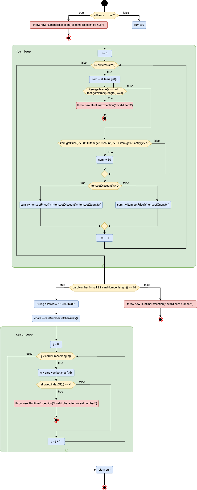
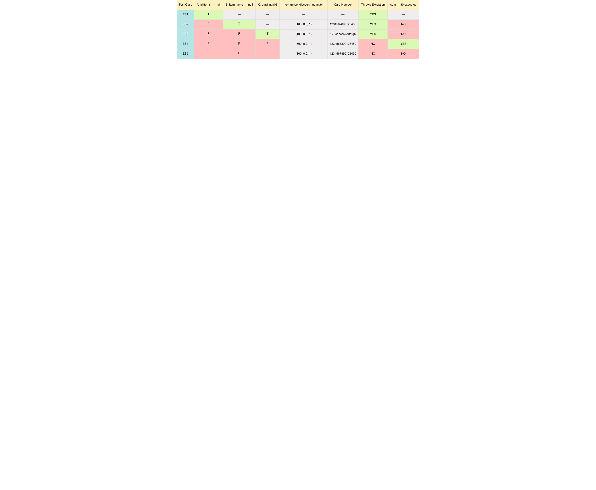
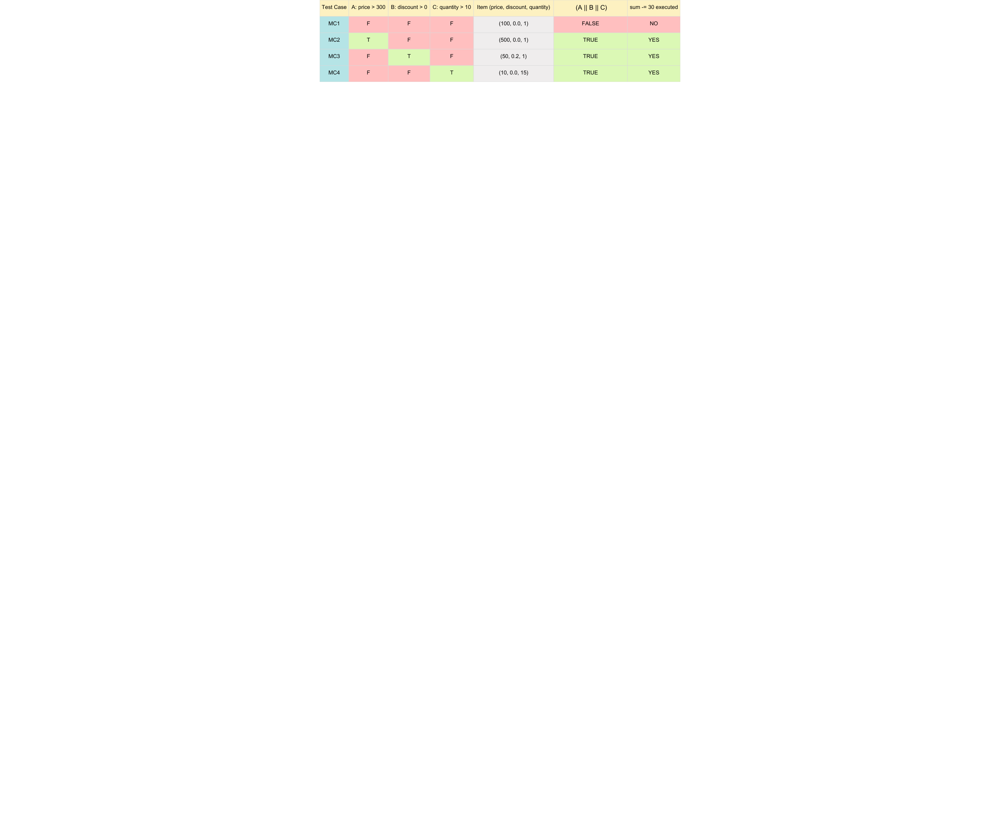

# Втора домашна задача по Софтверско инженерство

## Јана Ангеловска, бр. на индекс 202033

### Група на код: 

Ја добив групата на код 5

###  Control Flow Graph

### Цикломатска комплексност

Цикломатската комплексност е дефинирана со `V(G) = E - N + 2`, каде што `E` е број на ребра и `N` е број на јазли на
CFG.

`V(G) = 19 - 12 + 2 = 9`

Цикломатската комплексност на овој код е 9

### Тест случаи според критериумот Every statement 

Минимален број на тест случаи: 5

### Тест случаи според критериумот Multiple Condition

Минимален број на тест случаи: 4

### Објаснување на напишаните unit tests

...
...
